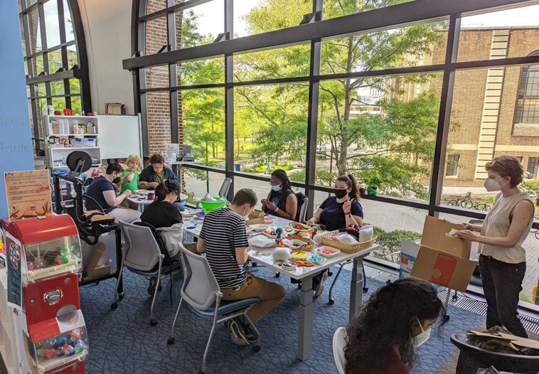

# My Journey through my first DH class

Hello! My name is Claudia Merchan and I am currently a sophomore in the College of Arts & Sciences majoring in Philosophy, Politics, and Economics. Some background about myself is that I am from Hackensack, New Jersey and for most of my life I've always focused on taking the traditional humanities classes. When arriving to Penn rumors of how difficult most STEM courses are here, steered me away from taking courses that were outside of my comfort zone. This semester, though, in hopes of both fulfillling requirements and branching out, I took my first digital humanities course at Penn and learned a whole new area of study. In this page I will go through my journey, projects, failures and successs throughout this course. Now having completed the course I will reflect on the skills and knowledge I am able to take with me and what I hope to do with them in the future. 

## Reflecting on the projects I participated in 

First I will walk through this course from beginning to end. I will start of from the first class trips up to the last ones and highlight what I learned along the way. I will also talk about how the themes in this course continued to be established through the projects that we completed. Finally, I will  share some of the most surpising things that I learned throughout this course and will also reflect on some of my strengths and weaknesses that allowed me to reach this point in my journey (the page your currently reading). 

Here is a link to my [statement where I reflect on my experience in this class](reflection.md) 

![reflection] (reflection1.png) 

## First Time Attending a Workshop at Penn!

Now I will dive into a large component of this course which included the requirement of attending a workshop at Penn. The purpose of this was to engage with digital humanities through an on-hands experience and learn about these opportunities on campus. 

Here is a link to my [statement where I reflect on my experience at a Penn workshop](reflectionpenn.md) 

## First Time Attending a Workshop in Philadelphia!

Next, I want to share another large part of the hands-on component of this course which was to branch outside of the Penn community and looking into the Philadelphia community for opportunities to engage with Digital Humanities as well. 

Here is a link to my [statement where I reflect on my experience at a Philadelphia workshop](reflectionphiladelphia.md)

 

## Onto What's Next!

Now that I have reached the end of this course and been able to reflect on some of the amazing opportunities I was able to experience I will talk about what I hope to do with the content that I learned. 

This is a link to my [statement where I look forward to nexts steps following this course](lookingforward.md)

 
