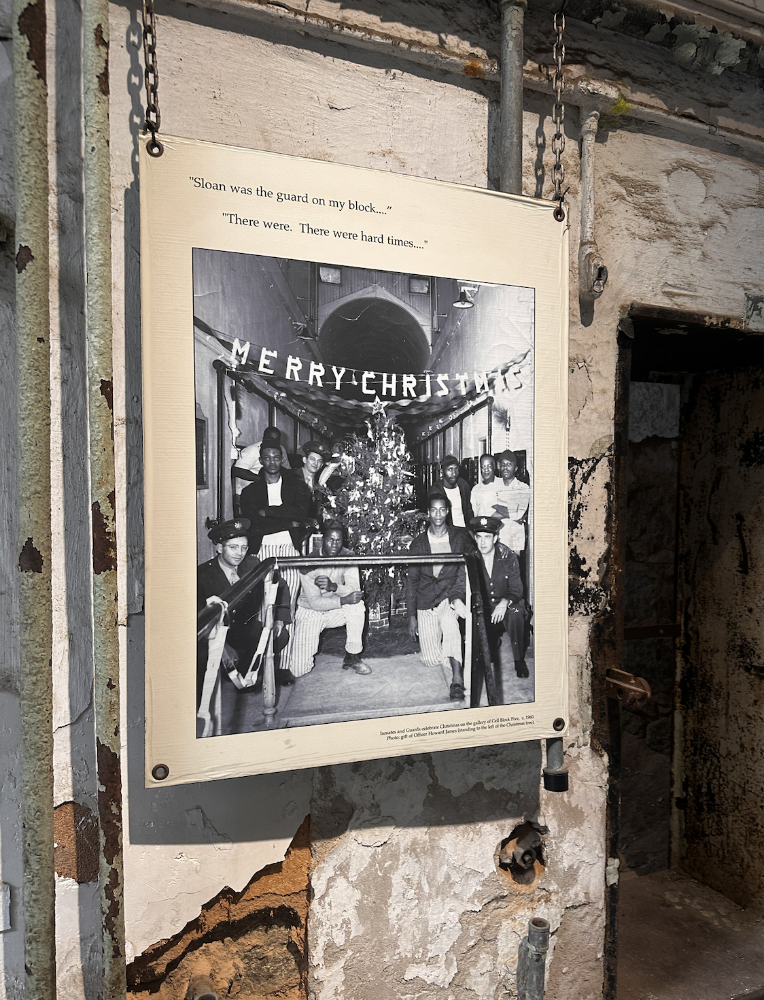
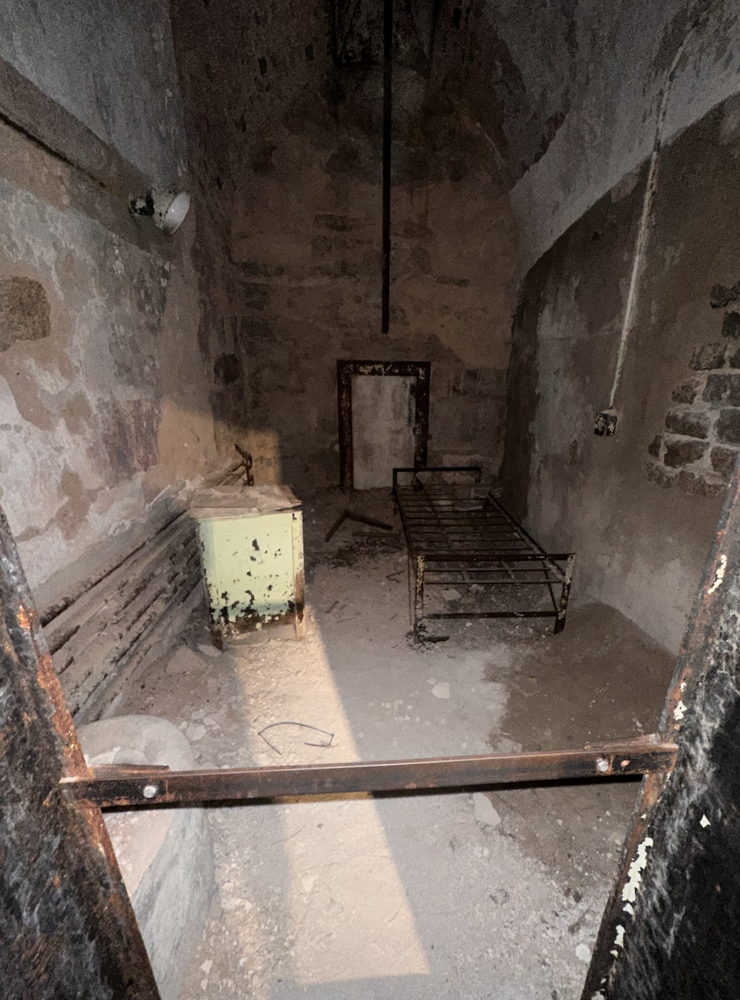
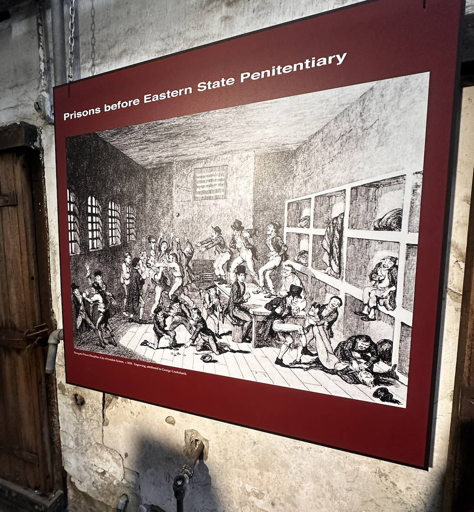
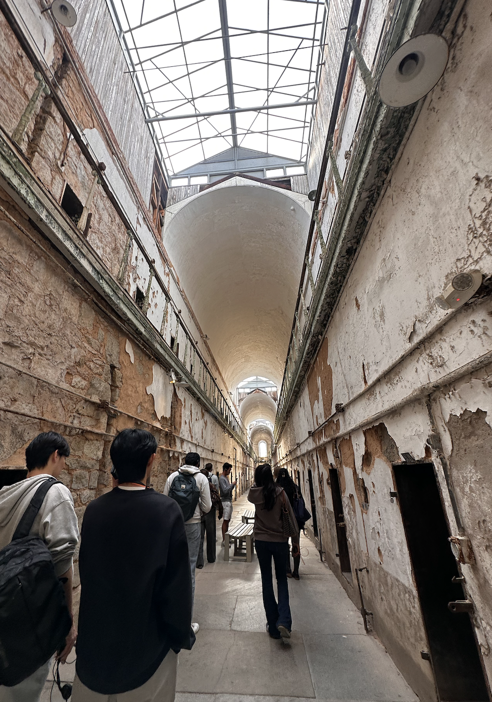

# Reflection

Throughout this course, my peers and I have participated in various activities, projects, and trips to enhance our knowledge of digital humanities. We started the beginning of the course with a basic introduction to what digital humanities is and how the effects of digital humanities can lead to preservation while also enhancing the risk of misinterpretations of data. One of the early trips we made as a class was to Van Pelt Library where we learned more about the Kislak Center for Rare Books, Manuscripts and Special Collections, and SCETI which were in the basement and 6th floor of the library. This trip served as an introduction and exposure to what digital humanities is and the people who work behind the scenes to preserve data. This trip went hand in hand with some of the readings such as “The House that Archives BuiltLinks to an External Site” by Dorothy Berry and “The Uncanny Valley and the Ghost in the Machine” by Dot Porter”. In Berry’s article, she explores the meaning of archives and how they can play a role in preserving African American history but how archives also face some challenges in biases, vagueness, and mishandling. Similarly, we also read in Porter’s paper about the concept of digitizing medieval manuscripts and how digitization can create a sense of familiarity as well as originality among manuscripts meant to be preserved. From this first portion of the class, we learned themes of preservation and challenges to digital archiving. These themes were further explored through our trip to the Eastern State Penitentiary. During our trips, we were able to experience firsthand some of the historical information from The Umpire and learn more about the actions taken toward criminal justice reform. Below are some images from our tour and visuals of the remains of the previous inmate cells. 

The visit to the ESP continued those themes of historical interpretation through images and preservation of the cells, which served to provide more context for further research on the Umpire, but this visit did not incorporate as much of the digital component of the course. Once we started our Printing in Prisons project we were able to include the historical knowledge and the digital aspect of this project. Initially, I was a bit confused about how the outcome of this project would appear, especially since navigating a GitHub page was new to me. As I look back, something that I wish I had done was ask more questions towards the beginning about how to go about how to develop further my topic without as much historical information. For example, I focused specifically on Mlle. Petite Elba, the child actress, but couldn’t find much information on her besides in The Umpire, which made my process a bit more challenging, but if I had asked more questions I probably could’ve developed stronger ideas to develop in my research. Regardless, this was a new kind of project for me so I am proud of the way I was able to adapt my skills to this and used my reflections from our trips to the Library and the ESP to emphasize the role of digital preservation. Through this project, I also realized how much I enjoyed creating my page and learning about syntax. Through trial and error in my coding, although frustrating at times, was a rewarding process, and seeing my final result allowed me to feel proud of how much I’ve learned in this course. 

This is a link to my [printing in prisons project](https://printinginprisons.org/blog/merchanc/)

The next project that we went on was at Education Commons. I had never been to Education Commons before so learning about this resource on campus truly surprised and interested me. For this project, I was a part of the textiles/textures group and initially, once again I was a bit confused about how to go ahead with this project and the purpose of it. Something that I wish I had done differently throughout this project was engage more with the staff at EC and ask questions about all of the possibilities. I would say since it was most of our first time at this location, we wanted to focus on doing a project that had already proven successful which is why we took inspiration from the Runaway Quilt Project. Regardless though, through collaboration and creativity, we were able to add our own knowledge into the project which also served as a great learning experience. Reflecting on this project, I would say I learned the most about digital humanities because it taught me the importance of balancing historical data with creative interpretation and technological accuracy. 

As I reflect on this course I would say that it is not what I thought it would be when I first signed up. I initially thought that the course would be focused strictly on learning digital and technical skills like what we do on the GitHub page. I expected to learn more about coding and software tools with little connections to humanities which worried me in the beginning because my background has been in strictly math or humanities courses. Instead, the content connected very closely to history and topics relevant to humanities. This course allowed me to explore a new area of study and taught me the importance of balancing preservation with creativity, as well as the importance of asking questions when trying something new. All in all, I am very grateful to have been able to participate in this course and to have found an interest in learning about syntax and the small details of what makes a larger webpage. 
