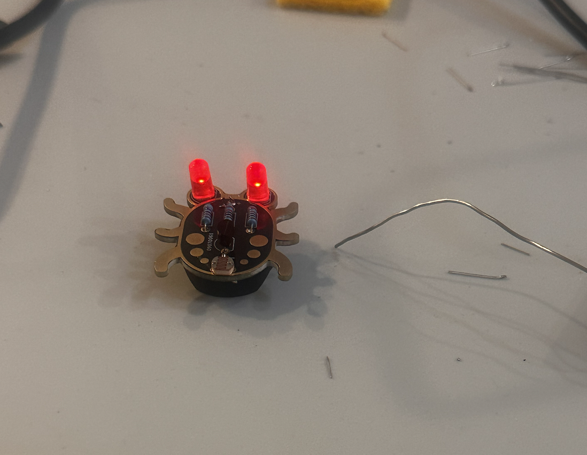
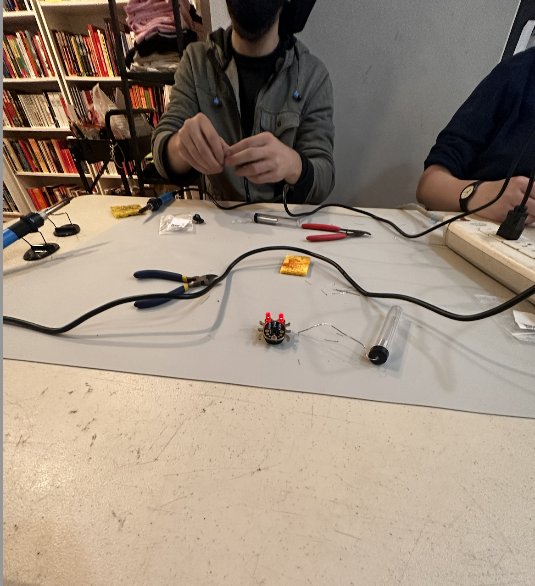

# First Time Attending a Workshop in Philadelphia!

For my workshop in Philadelphia, I attended the Beginner Soldering Workshop at Iffy Books. Through this workshop, I was able to learn about the skills and knowledge required to begin soldering. I had never actually heard what soldering is or what it is used for. Although this resulted in my confusion towards the beginning of the workshop, I was quickly able to pick up the instructions and went along with completing the task assigned. Upon arrival at Iffy Books one of the first things I noticed was that I had never heard of a place such as this and had never made my way to this part of Philadelphia. Throughout the workshop, it was only me and one other person besides the instructor which allowed for both of us to receive one-on-one attention through the process of learning the basics of soldering. The instructor first began by explaining the instructions for the project we would work on that day and some of the important things to note as a part of safety as well. Before the workshop, I had never seen some of the tools on the table so it was great to be exposed to something unknown to me. Throughout the workshop, I went on putting pieces together and working through trial and error to eventually create a bug-like creation that lights up. Initially, I was having trouble grasping the idea of soldering and how to maintain my hands steady as well as making sure that I don’t get burned and make my creation look physically appealing. In the image below I show what my outcome looked like. 

Overall, the experience was truly a transformative experience and made me think differently about technology and its tools. I have never envisioned myself being able to create something like this and to have enjoyed the entire process. 

The workshop related to many concepts we’ve learned about in class, specifically, our journey in learning about Education Commons. At Education Commons, we were forced to get out of our comfort zones and bring the information we’ve been learning about all semester to life. Furthermore, at Education Commons, we were exposed to creativity and innovation while crafting the design for our project. This relates closely to my experience at this Soldering Workshop because, throughout my journey of creating my prototype, I was able to connect digital content to something physical. Additionally, the process of doing the project at the Education Commons taught me to think outside of the box and see ideas come to life with the use of technological advancement.
Additionally, when going through this workshop I reflected on the reading by Jenetry Sayers “I Don’t Know All the Circuitry”. In this article, Sayers’ quote “I Don’t Know All the Circuitry” is joked about because she admits to not knowing about the technical details and hardware that she works with. As I reflect on this workshop I can connect these two pieces of knowledge and relate to Sayers’ quote because sometimes even without knowing all of the intricate details of a technology, a creative process doesn’t require this and still allows you to be successful. 

As I reflect on this workshop, I am truly grateful for the experience of stepping away from the campus and exploring digital humanities opportunities in Philadelphia. Through this experience, I was able to reflect on the content and history we had been discussing throughout our classes. This workshop also gave me my first glimpse at building a piece of technology through hands-on experience.  After leaving I felt strongly about my ability to be innovative when it comes to technology and in this class. 
